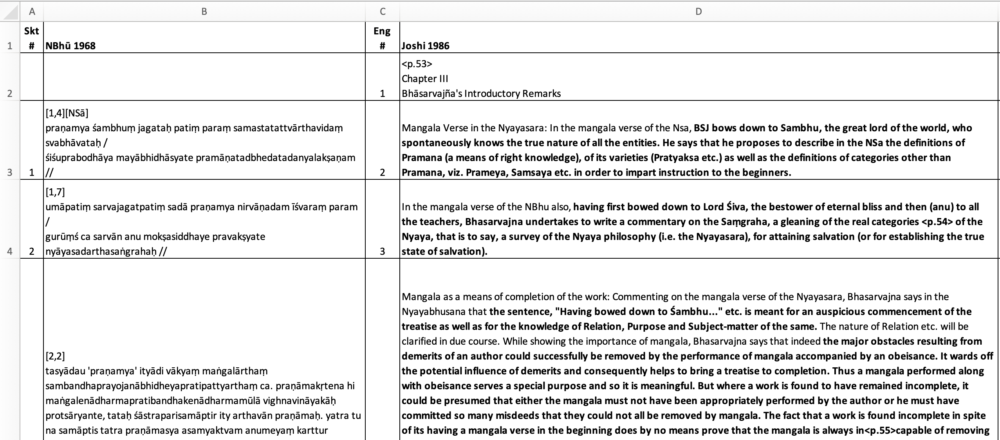

# align_nbhu_pratyaksa

This is a paragraph-level alignment of Joshi's English translation of much of the Nyāyabhūṣaṇa Pratyakṣapariccheda (in his 1986 book, “A Critical Study of the Prayakṣa Pariccheda of Bhāsarvajña's Nyāyabhūṣaṇa”) to the Sanskrit text (edition of Yogīndrānanda 1968), in simple tabular form.

So far (Dec 2021), I've done chapters 3–7 out of the relevant chapters 3–14.

# screenshot of spreadsheet

# quickly view HTML version

[Click here to view the table in simple HTML](https://htmlpreview.github.io/?https://github.com/tylergneill/align_nbhu_pratyaksa/blob/master/alignment.htm). The bold shows which English is actually translating Sanskrit.

# details on the work in progress

I first extracted the pre-OCRed content from Joshi's 1979 dissertation PDF (i.e., copied and pasted text from the PDF), which I obtained on Shodhganga, and I gradually cleaned it manually with regex etc.

Later, I scanned Joshi's 1986 book (the published and very slightly revised form of the 1979 dissertation) to PDF, manually cropped out the footnote material, and OCRed the pages using Google Vision via Google Drive. Although I consider this the best option available at present, the resulting text was not very satisfactory, even after performing some basic structural cleaning; many words remained garbled, and the poor scan quality results in lots of artifacts like stray dots. (In hindsight, it would have saved me a lot of work to somehow secure a more perfect scan of the book and OCR that instead.)

Also, comparing the two versions of Joshi's translation (1979 and 1986), I found instances where improper editing of the 1986 book resulted in occasional loss of information from the 1979 version. I therefore decided with work with both and produce a best version.

Working one chapter at a time, I first separate the OCRed text of each version into paragraphs (prioritizing the 1986 division). This requires more manual cleaning. I then load these aligned English paragraphs into the "text and translation" sheet of the spreadsheet.

Then I go to the corresponding Sanskrit text\* (the "chapter overview" sheet of the workbook contains the overall association of Joshi chapters to Sanskrit edition text pages), and I copy and paste it into the "text and translation" sheet of the spreadsheet to the left of the corresponding English, aligning manually at the paragraph level. Already here it becomes clear that most English paragraphs do consist mostly of literal NBhū translation, although some contain none at all.

\*The NBhū e-text was obtained anonymously through peers. I believe it may stem from Shodo Yamakami's work, but certainly only after being filtered through the work of others, I think Ernst Prets and Sylvia Stark. I've been slowly improving this and host it now on my Pramāṇa NLP project (see [separate repo](https://github.com/tylergneill/pramana-nlp)).

Since the English translation does not proceed in the same order as the original Sanskrit book, I also provide sequential numbers for each, allowing the spreadsheet to be sorted either according to the order of the Sanskrit or that of Joshi's English presentation.

Then, one paragraph at a time, I take the two versions of the English translation for a given paragraph, and I use the diff-like "compare" function of BBEdit to reconcile differences between the two. This involves lots of copying and pasting between the two programs, and lots of manual adjustment, but supervised by the automatic word alignment functionality of BBEdit. I lightly read and consider the content as I do this.

Finally, once the two English versions have been reconciled (although not perfectly proofread, so mistakes do definitely stilll remain), I delete the redundant 1979 content, and I compare the reconciled English to the Sanskrit. I then highlight in bold the parts of the English that directly correspond with Sanskrit. Finally, I also record a few notes on the side. 

Eventually, I would like to use this table, plus my dissertation work on NBhū 104–154 (the part skipped by Joshi) as a basis for my own full English translation of the Pratyakṣa chapter. I will likely also use the known manuscript witnesses to re-edit the Sanskrit text as I do so.