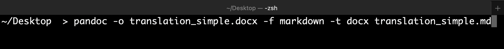

# translate_nbhu_104-154
This is where I keep public copies of my NBhū translation materials.

* [Overleaf source files](https://www.overleaf.com/read/vpnjgqqqptww) (also in form of zip file here)
* simplified Markdown derived from the above (removing footnotes, extra formatting, etc.)
* (also a DOCX file produced from the above Markdown file with pandoc; see below)

See also “align_nbhu_pratyaksa”, in which I align Joshi's English translation to the Sanskrit text.