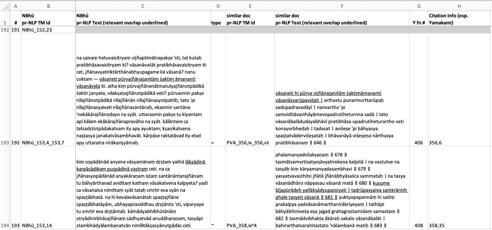

This repository contains just a single spreadsheet detailing intertextual citations extracted from the work of Shodo Yamakami's (1999) Japanese translation of NBhū 104–154 (translation pp. 159–265, footnotes pp. 266–291). It represents one step in the process of evaluating Vātāyana, an intertextuality detection system.

